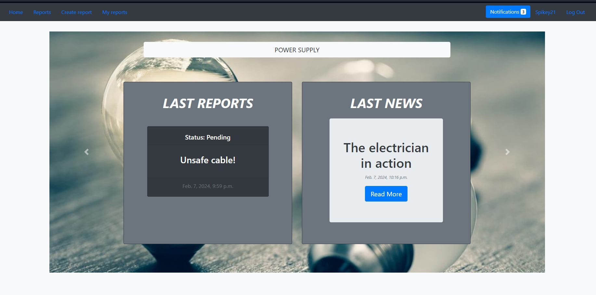
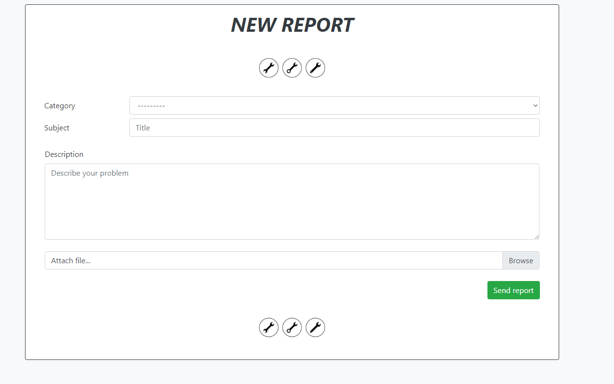

# **CITIZEN** **REPORT**
****

### *This is an application to create reports regarding any failure that can happen in the city. User can submit form of report to let clerk evaluate it. The Clerk will then review the report and decide whether the application will be considered. To every report, clerks can make a post about progress of an issue.* ###

****

## **GETTING** **STARTED**

1. Download
   * You need to clone repository to your local destination
       ~~~python
            $ cd path\to\your\workspace
            https://github.com/SDA-wrzesien-2023-gr2/citizen-report.git

   * if you have established ssh connection to github you can use this link to clone repo:
       ~~~python
              git@github.com:SDA-wrzesien-2023-gr2/citizen-report.git
   
2. Make virtual environment and activate it (optional) 
    ~~~python
             $ python -m venv venv
             $ venv\Scripts\activate   
3. Install requirements
    ~~~python
             $ pip install -r requirements.txt
4. After this you can create your superuser

    `python manage.py createsuperuser`

5. Finally, you can run application

    `python manage.py runserver 0.0.0.0:8000`

## **USAGE**

When project will be up, go to: http://localhost:8000/ Then you should see:

On the home page you can see the latest report and news in the power failure category. At right corner you will see user management panel. On the left you will be able to find navigation of site.

From here you have few option:

        1. User management - If you created superuser before you can login, but you can also create a normal user by signin up, important endpoints for this app:
            - 'authSystem/login/' normally login user
            - 'authSystem/signup/' creating user
            - 'authSystem/user/reset_password/' reset password for user who has forgotten their passwords, you will receive link via email to change password
            - 'authSystem/user/' profile of user
            - 'authSystem/user/change_password/' changing a password after login to system

        2. Endpoints for anyone:
            - 'reports/' all reports in the system, here you can search report or filter it by category or status
            - 'reports/<int:report_id>/' details of report, here you can find information if there are any news regarding report
            - 'reports/<int:report_id>/news/' all news about specific report
            - 'news/<int:news_id>/' detail of news, you can comment here, but you must be logged in to do so

        3. Endpoints for users(addition to the point 2.):
            - 'create/' here you can create your report, which will be assigned to appropriate clerk
            - 'my-reports/' my reports that I have submitted, you can filter it by status
            - 'notifications/' my notification, unread notification will be highlighted, to change this you need to click on notification
            - 'notifications/<int:notification_id>/detail' detail of notification, from here you can go to report or news depending on notification message
        
        4. Endpoints for staff member(clerks):
            - 'my-reports/' my reports that have been assigned to staff member, you can filter it by status
            - 'update-report/<int:report_id>/' here clerk is able to change status of the report, you can also decide if you want to make a news about report
            - 'reports/<int:report_id>/create-news/' here staff member can create news about report

To create a report:

            
Features:
   * `Category` - choose the category of the report
   * `Subject` `Descrition` - fill in with appropriate data
   * `Attach file...` you can attach some image to your report
   * `Send report` Sends POST request to http://localhost:8000/reports/
